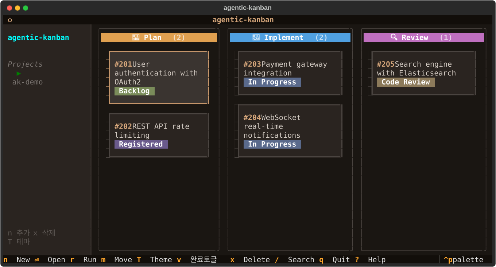

<p align="center">
  <h1 align="center">agentic-kanban</h1>
  <p align="center">
    <strong>AI 에이전트가 작업하는 터미널 칸반보드</strong>
  </p>
  <p align="center">
    이슈별 AI 에이전트를 할당하여 Plan → Implement → Review 파이프라인을 자동 실행합니다.
  </p>
</p>

<p align="center">
  <a href="https://github.com/wooyounggggg/agentic-kanban/blob/main/LICENSE"></a>
  <a href="https://www.python.org/downloads/"></a>
  <a href="https://github.com/wooyounggggg/agentic-kanban/issues"></a>
</p>

---



## Why agentic-kanban?

> 여러 이슈를 병렬로 AI에게 맡기고, 결과를 한눈에 관리하고 싶다.

기존 AI 코딩 도구는 한 번에 하나의 작업만 처리합니다. agentic-kanban은 칸반보드에서 여러 이슈에 각각 AI 에이전트를 할당하고, 정해진 파이프라인에 따라 자동 실행합니다.

- 📋 **칸반보드** — 이슈 상태를 한눈에. vim 키바인딩 지원
- 🤖 **AI 파이프라인** — Plan → Implement → Review 단계별 에이전트 실행
- 📡 **실시간 스트리밍** — 에이전트 작업 진행 상황을 실시간 확인
- 🔗 **Dooray 연동** — [NHN Dooray](https://dooray.com) 티켓 조회, 댓글, 자동 동기화
- 🎨 **8가지 테마** — brown, catppuccin, nord, github-dark 등

## Quick Start

**요구사항:** Python 3.9+, [Claude Code CLI](https://docs.anthropic.com/en/docs/claude-code)

```bash
git clone https://github.com/wooyounggggg/agentic-kanban.git
cd agentic-kanban
pip install -e .
```

```bash
cd <프로젝트 디렉토리>
agentic-kanban init    # 최초 1회
agentic-kanban         # TUI 실행
```

## How It Works

```
┌─────────────────────────────────────────────────────────┐
│                    agentic-kanban                         │
│                                                           │
│  ┌──────────┐  ┌──────────┐  ┌──────────┐  ┌──────────┐ │
│  │ 📝 Plan  │  │🔨 Impl   │  │🔍 Review │  │✅ Done   │ │
│  │ #101     │  │ #103 ⟳  │  │ #105     │  │ #106     │ │
│  │ #102     │  │ #104     │  │          │  │          │ │
│  └──────────┘  └──────────┘  └──────────┘  └──────────┘ │
│                                                           │
│  r키 → 프롬프트 입력 → claude 실행 → 결과 저장             │
└─────────────────────────────────────────────────────────┘
```

| 단계 | 설명 | 산출물 |
|------|------|--------|
| 📝 **Plan** | Spec + 참고 지식으로 구현 계획 수립 | `plan.md` |
| 🔨 **Implement** | Plan 기반 자동 구현 | 코드 변경 |
| 🔍 **Review** | 수정 프롬프트로 코드 수정 | 코드 수정 |
| ✅ **Completed** | 완료 | — |

## Configuration

```yaml
# .board/config.yaml
project:
  name: my-project
  worktree_base: worktrees
  base_branch: develop

tracker:
  type: dooray
  dooray:
    cli_path: ~/.mcp-global-server/dooray-cli.js
    api_key: <your-api-key>
  sync_interval: 60

ui:
  theme: brown
```

## License

[MIT](LICENSE)
