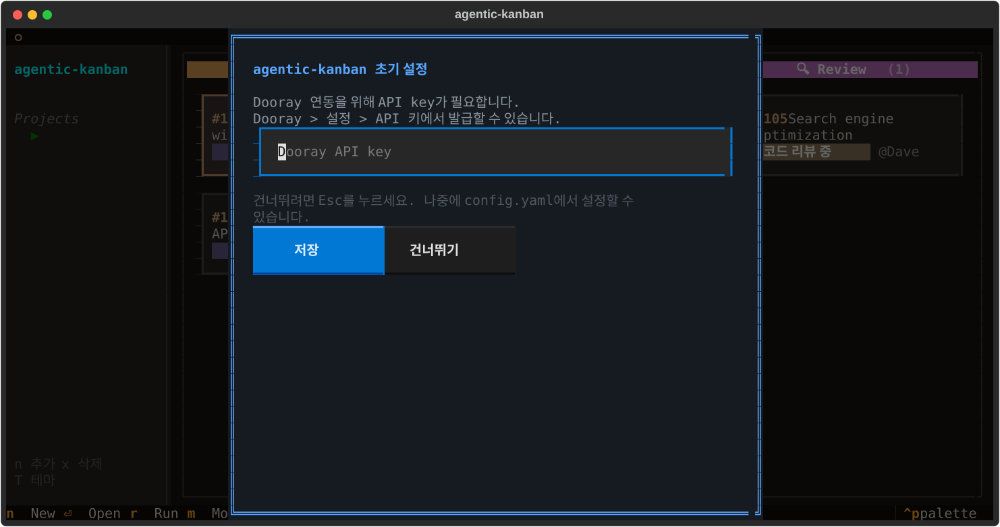

# agentic-kanban

AI 에이전트 기반 파이프라인 실행을 지원하는 TUI 칸반보드.

Git worktree 기반 병렬 개발 워크플로우를 관리합니다. [NHN Dooray](https://dooray.com) 이슈 트래커와 연동되며, [Claude Code](https://docs.anthropic.com/en/docs/claude-code) CLI를 에이전트로 사용합니다.



## 특징

- **파이프라인 실행**: Plan → Implement → Review → Completed
- **AI 에이전트**: Claude CLI를 백그라운드로 실행, 실시간 스트리밍 로그
- **칸반보드**: 이슈 상태 관리, 마우스/키보드 네비게이션
- **Dooray 연동**: 티켓 조회, 댓글, 자동 폴링 (60초 주기)
- **멀티 프로젝트**: 사이드바에서 프로젝트 전환
- **테마**: 8가지 컬러 테마 (brown, catppuccin, nord 등)

## 요구사항

- Python 3.9+
- [Claude Code CLI](https://docs.anthropic.com/en/docs/claude-code) (`claude` 명령)
- [NHN Dooray](https://dooray.com) 계정 + API key (이슈 연동 시)

## 설치

```bash
cd agentic-kanban
pip install -e .
```

## 실행

```bash
cd <프로젝트 디렉토리>
agentic-kanban init    # 최초 1회 (.board/ 생성 + Dooray API key 설정)
agentic-kanban         # TUI 실행
```

또는 pip 설치 없이:
```bash
PYTHONPATH=agentic-kanban/src python3 -m agentic_kanban.cli.main
```

## 파이프라인

각 이슈는 4단계를 거칩니다. `r`키로 실행합니다.

### 📝 Plan
구현 계획 수립. Spec + 참고 지식 + TC(선택) 프롬프트를 입력합니다.
에이전트가 `plan.md`를 작성합니다.

### 🔨 Implement
Plan 기반 자동 구현. 확인 후 에이전트가 코드를 작성합니다.
프로젝트의 `CLAUDE.md`가 코드 품질/컨벤션을 관리합니다.

### 🔍 Review
코드 수정 단계. 수정 프롬프트를 입력하면 에이전트가 반영합니다.

### ✅ Completed
완료. `v`키로 칸반에서 숨기기/보이기.

## 단축키

### 칸반보드
| 키 | 동작 |
|---|---|
| Enter | 이슈 상세 |
| r | 파이프라인 실행 (상태별 다이얼로그) |
| n | 새 이슈 추가 (Dooray 티켓번호 조회) |
| m | 상태 이동 |
| x | 이슈 삭제 |
| v | 완료 이슈 토글 |
| T | 테마 변경 |
| ? | 도움말 |
| ←→↑↓ | 네비게이션 (hjkl 지원) |
| q (x2) | 종료 |

### 상세 화면
| 키 | 동작 |
|---|---|
| r | 파이프라인 실행 |
| m | 상태 이동 |
| a | Agent 로그 토글 (실시간 스트리밍) |
| p | Plan 토글 |
| t | Ticket 토글 (Dooray 본문) |
| c | Comments 토글 (Dooray 댓글) |
| l | Worklog 토글 |
| f | Dooray 조회 (본문 + 댓글) |
| Space | TC 체크 토글 |
| Esc | 뒤로 |

## 테마

`T`키로 8가지 테마 선택 (재시작 시 적용):

brown, catppuccin, nord, github-dark, dracula, solarized-dark, gruvbox, tokyo-night

## 데이터 구조

```
.board/
├── config.yaml          # 프로젝트 설정 (Dooray API key, 테마 등)
├── issues/
│   └── {ticket}/
│       ├── issue.yaml     # 이슈 메타데이터
│       ├── plan.md        # 구현 계획 (에이전트 작성)
│       ├── checklist.yaml # TC 체크리스트
│       ├── worklog.jsonl  # 작업 로그 (에이전트 자동 기록)
│       ├── agent.log      # 에이전트 실시간 로그
│       ├── description.md # Dooray 본문
│       └── comments.md    # Dooray 댓글
├── archive/              # 완료된 이슈
└── cache/                # 캐시
```

## 라이선스

MIT
